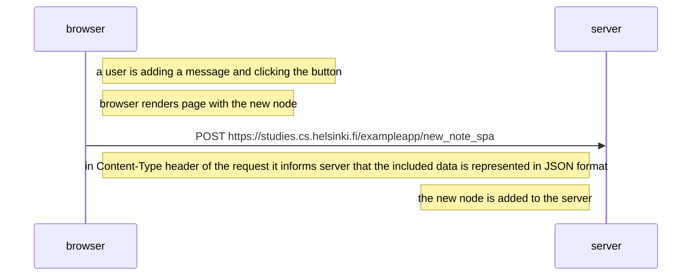

```mermaid
sequenceDiagram
    participant browser
    participant server

    Note right of browser: a user is adding a message and clicking the button

    Note right of browser: browser renders page with the new node
    browser->>server: POST https://studies.cs.helsinki.fi/exampleapp/new_note_spa
    activate server

    Note right of browser: in Content-Type header of the request it informs server that the included data is represented in JSON format

    Note left of server: the new node is added to the server

```
