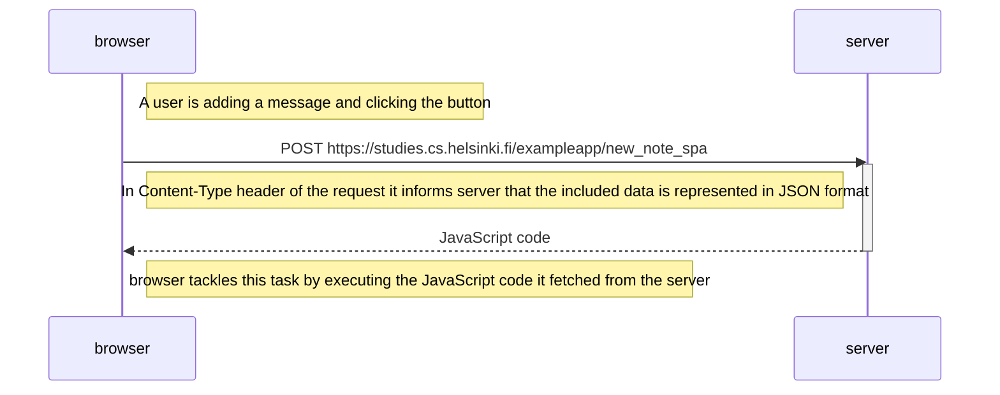

```mermaid
sequenceDiagram
    participant browser
    participant server

    Note right of browser: A user is adding a message and clicking the button

    browser->>server: POST https://studies.cs.helsinki.fi/exampleapp/new_note_spa
    activate server

    Note right of browser: In Content-Type header of the request it informs server that the included data is represented in JSON format

    server-->>browser: JavaScript code
    deactivate server

    Note right of browser: browser tackles this task by executing the JavaScript code it fetched from the server
```
